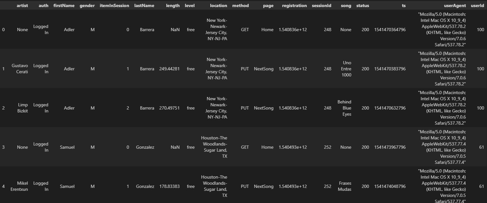

# PROJECT-MODULE02: Designing Data Warehouse
## Quick Start Instructions

1. Create a IAM user with necessary permissions
2. Create a IAM Role with a trusted policy and redshift as a service principal, 
3. Create a policy with AmazonS3ReadOnlyAccess access rights and assign to the IAM Role
4. Rename the dwh_template.cfg to dwh.cfg and fill the empty values
5. Install python + AWS SDK + Anaconda
6. install the packages described in requirements.txt
7. Run the IaC.ipynb to create the Redshift Cluster
8. Run the script python create_table.py to create all the tables
9. Run the script python etl.py to ingest all the data into the tables

---
## Overview

The project Sparkify, music streaming startup, is made up by the following:

* The definition and creation of the data model in the data warehouse Redshift
* The load and ingest data process into the Staging and analytics tables  which were created in Redshift database

The source Data sets are a set of files in JSON format stored in AWS S3 buckets:

* **s3://udacity-dend/song_data**: It contains the data about artists and songs

  `{"num_songs": 1, "artist_id": "ARJIE2Y1187B994AB7", "artist_latitude": null, "artist_longitude": null, "artist_location": "", "artist_name": "Line Renaud", "song_id": "SOUPIRU12A6D4FA1E1", "title": "Der Kleine Dompfaff", "duration": 152.92036, "year": 0}`

* **s3://udacity-dend/log_data**: It contains all the event data of the service usage e.g. who listened what song, when, where, and with which client
  
* **s3://udacity-dend/log_json_path.json**: It contains metadata used to map the events data with the column of the staging redshift table

Below, some figures about the data set (results after running the etl.py):

* s3://udacity-dend/song_data: StagingSongs, 14896 DB rows
* s3://udacity-dend/log_data: StagingEvents table, 8056 DB rows
* songplays: 1144 rows
* (unique) users: 104 rows
* songs: 14896 rows
* artists: 10025 rows
* time: 6813 rows

This project creates a AWS Redshift Cluster using the IaC.ipynb file. With the etl.py python program, it fetchs all the data from the JSON files, process this data and insert or load into the staging redshift tables and analytics table. Also the create_tables.py is necesary to create all the tables in the redshift database.

---


## About Database Star Model Design

Sparkify analytics database  schema has a star design. Start design means that it has one Fact Table having business data and it is where the events data are stored, and  Dimension Tables (Users, Songs, Time, Artist).


_*SparkifyDB schema Diagram.*_

### AWS Redshift set-up

AWS Redshift is used as the datawarehouse solution. A start model schema was designed in order to execute queries efficiently

* Cluster: 4x dc2.large nodes
* Location: US-West-2 (as source AWS S3 bucket)

### Staging tables
The Staging tables were designed with even distribution style to provide a fast loading from S3 files data.

* **staging_events**: event data telling what songs users have played (columns: id (id of the event),artist, auth, firstName, gender, itemInSession, lastName, length, level, location, method, page, registration, sessionId, song, status, ts, userAgent, userId int)

* **staging_songs**: song data about songs and artists (columns: num_song, artist_id, artist_latitude, artist_longitude, artist_location, artist_name, song_id, title, duration, year) PK: song_id

### Fact Table

* **songplays**: song play events data. It was designed with a Key distribution style with user_id as the hash key, It has the user_id as the hash key in order to reduce the shuffling when joins operations with the table users are performed. It centralizes the user, artist, time and song info (songplay_id, start_time, level, session_id, location user_agent, user_id, artist_id, song_id) Sort_key: compound key (user_id, start_time, song_id)

### Dimension Tables

* **users**: user info (columns: user_id, first_name, last_name, gender, level) Distribution Style: ALL Sort_key: user_id. If this table were a big table it would be consider with a hash distribution
* **songs**: song info (columns: song_id, title, artist_id, year, duration) Distribution Style: ALL Sort_key: song_id.
* **artists**: artist info (columns: artist_id, name, location, latitude, longitude) Distribution Style: ALL Sort_key: artist_id.
* **time**: detailed time info about song plays (columns: start_time, hour, day, week, month, year, weekday) Distribution Style: ALL Sort_key: start_time

---

## HOWTO use

### Prerequisites

The project used:

* Python
* Anaconda To launch the environment with jupyter notebook.
* _AWS SDK (boto3)_ and dependencies To interact with the AWS APIs (Create Redshift Cluster, Role IAM, List all objects in the S3 bucket) (Install dependecies with pip3 install -r requirements.txt)
* redshift-connector Used to establish connection with AWS Redshift and execute analytics Querys
* _jupyter_ For Used to enabled the Jupyter Notebook
* _ipython-sql_ 

### Run create_tables.py

Type to command line:

`python create_tables.py`

* All tables are dropped.
* New tables are created: 2 (staging tables) + 4 (dimensional tables) + 1 (fact table).
* Output: _"Tables dropped successfully"_ and _"Tables created successfully"_

### Run etl.py

Type to command line:

`python etl.py`

* Script executes COPY commands to insert source data to staging tables.
* From staging tables, data is inserted to analytics tables.
* In the end, script tells if whole ETL-pipeline was successfully executed.

Output: raw data is in staging_tables and data processed is in analytics tables.

## Sample Queries

* Get count of songplays by day:
```
SELECT t.day, 
        t.month, 
        t.year,
        count(*) AS count_song
    FROM songplays AS sp, time AS t
    WHERE sp.start_time = t.start_time
    GROUP BY t.day, t.month, t.year
    ORDER BY count_song DESC;
```

* Get the most played songs:

```
SELECT sp.song_id, 
        s.title, 
        count(*) AS count_song
    FROM songplays AS sp, songs AS s 
    WHERE s.song_id = sp.song_id  
    GROUP BY sp.song_id, s.title 
    ORDER BY count_song DESC

```

* Get count of rows in songplays table:

```
SELECT COUNT(*)
FROM songplays;
```
